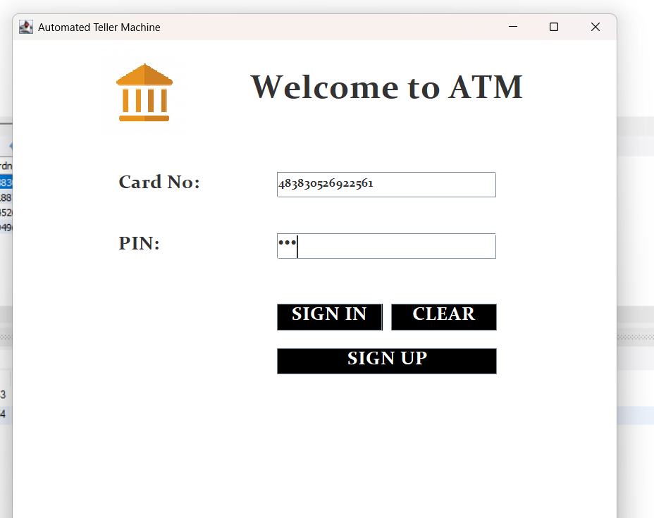
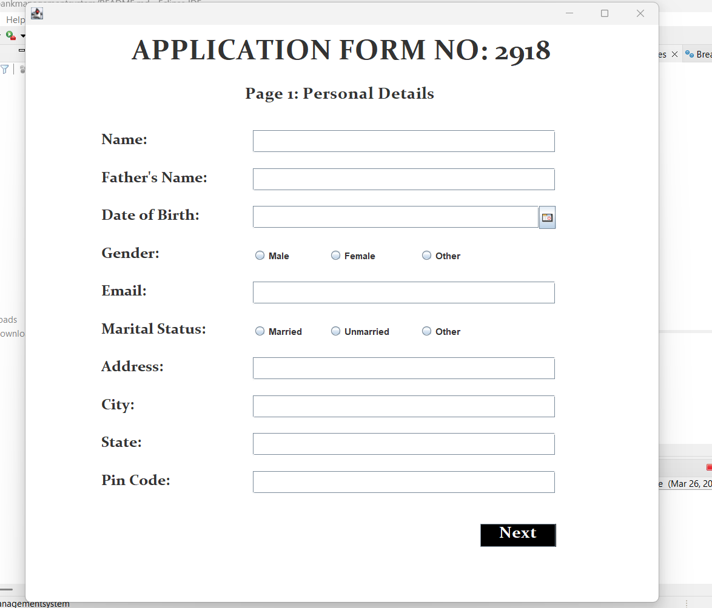
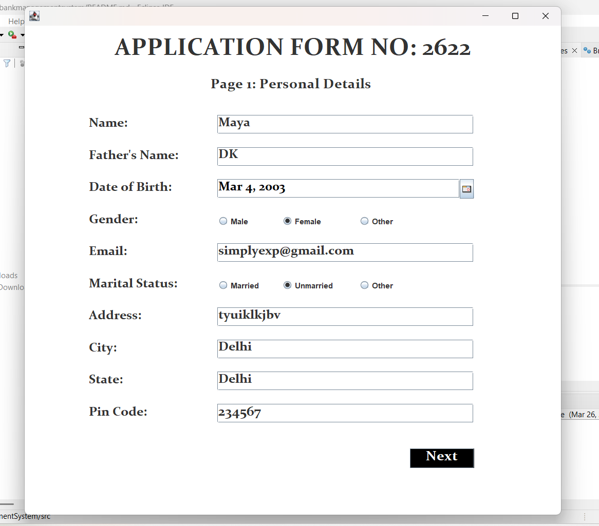
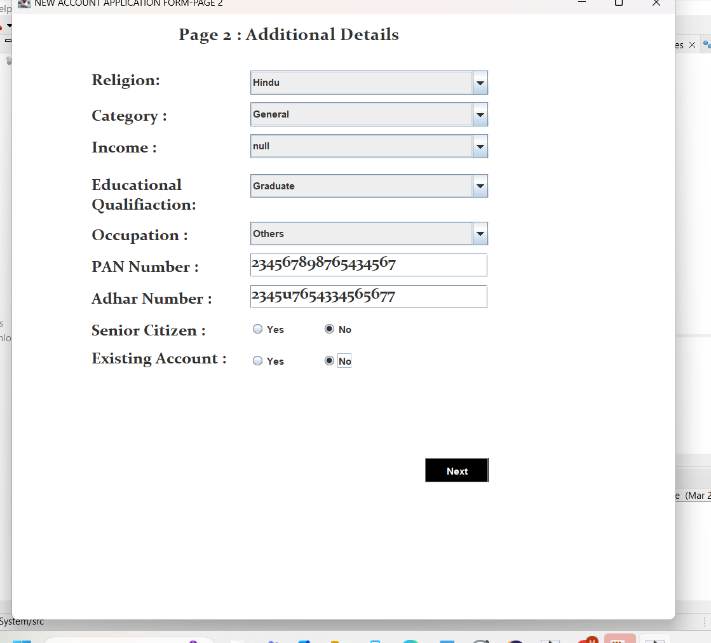
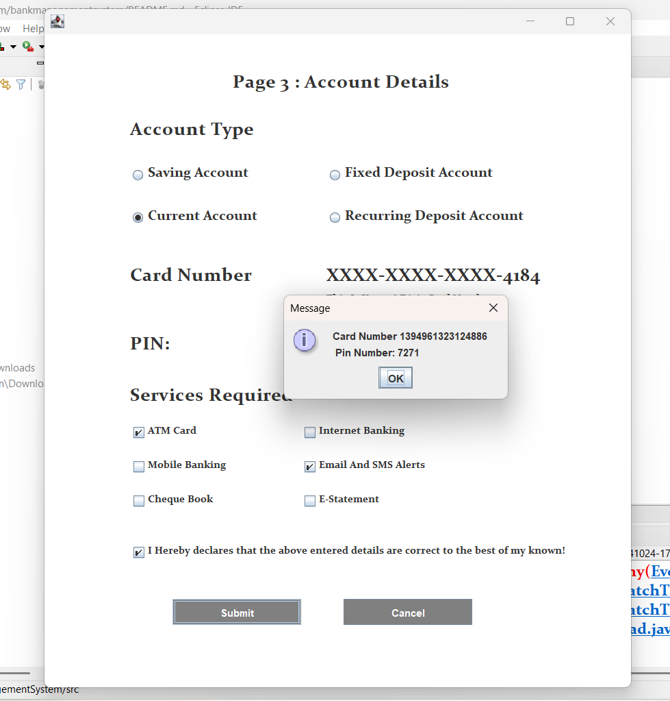
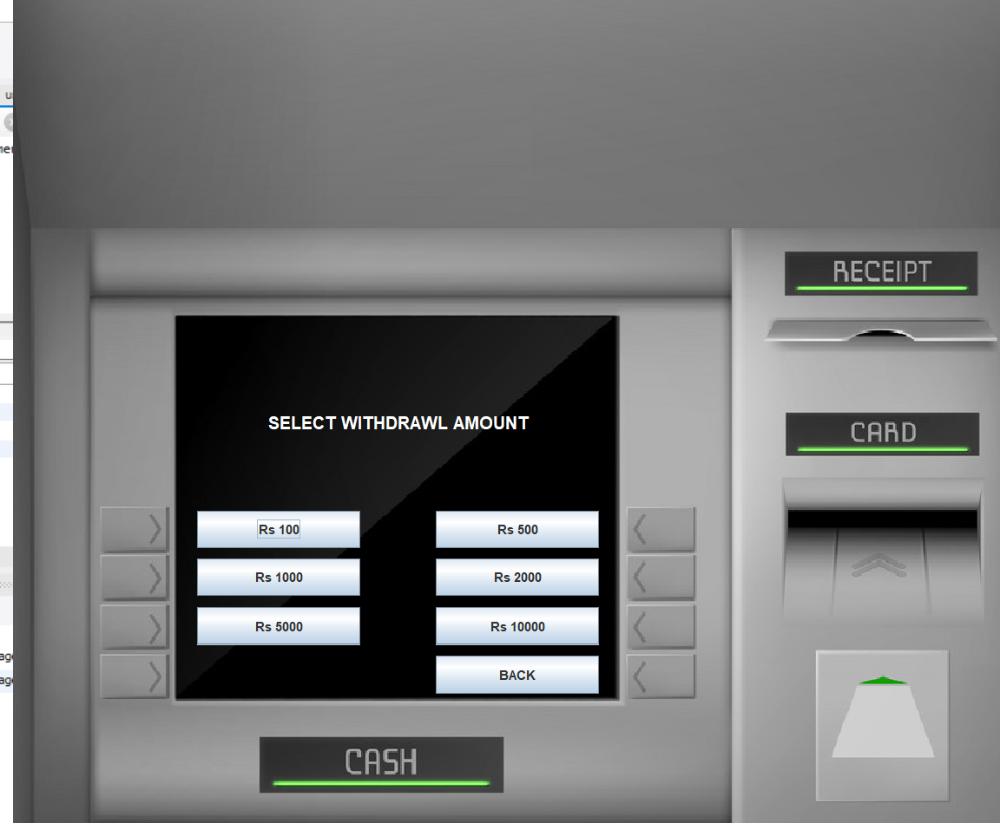
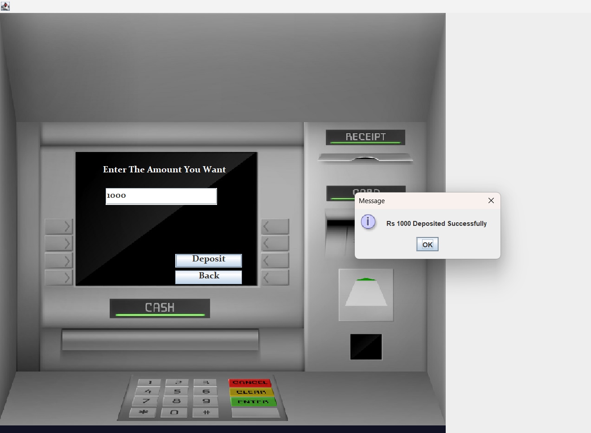
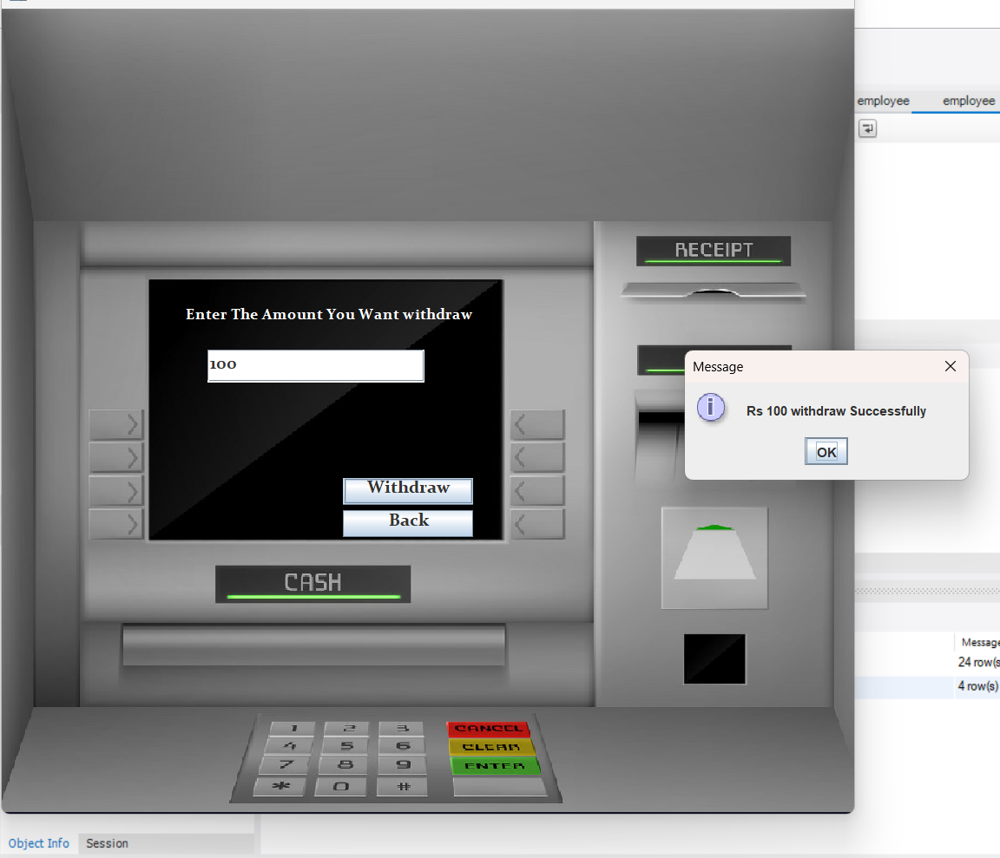
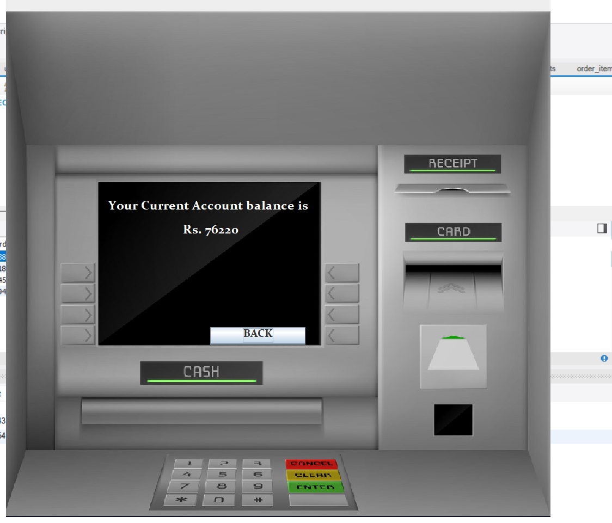
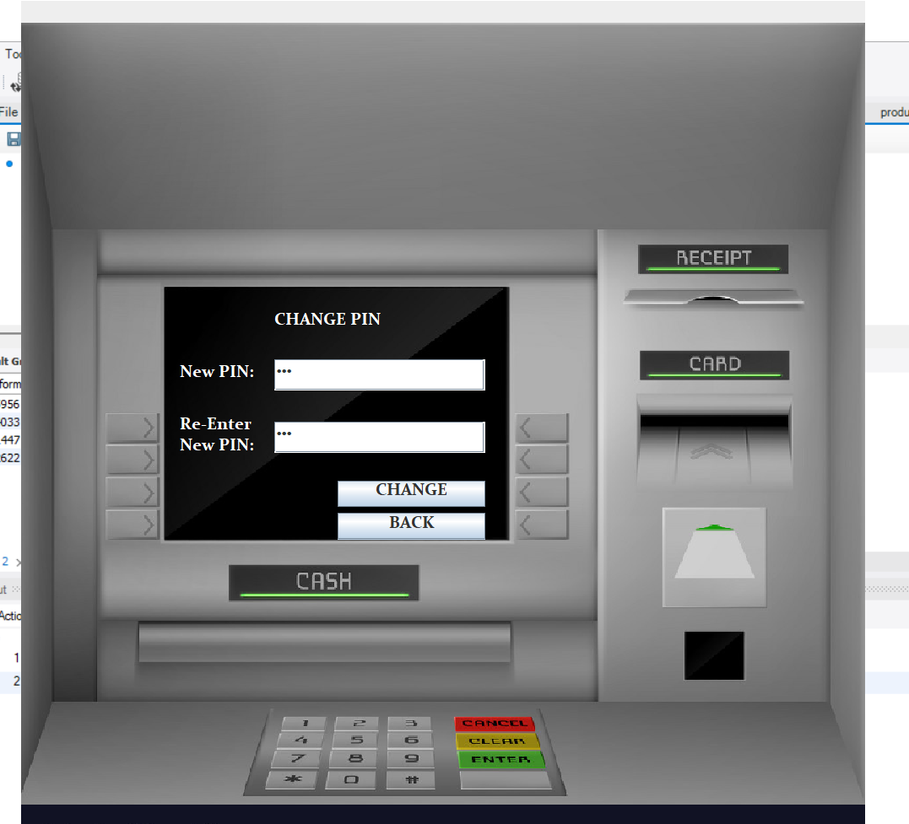

# Bank Management System

## About
This project is a simple Bank Management System built using Java, MySQL, and Swing. It allows users to perform basic banking operations like checking balance, making deposits, withdrawals, and changing PINs.

## Features
- **Login**: Secure user authentication for customers and admins.
- **Sign-Up**: Allows users to create a new account.
- **FastCash**: Quick deposit and withdrawal options.
- **Deposit**: Allows customers to deposit money into their accounts.
- **Withdraw**: Allows customers to withdraw money from their accounts.
- **Balance Enquiry**: Displays the current account balance.
- **PIN Change**: Allows users to change their PIN securely.

## Technologies Used
- **Java**: Programming language used for backend and GUI.
- **MySQL**: Database to store user data and transactions.
- **Swing**: GUI framework for creating the user interface.

## Pages/Screens

### 1. **Login Screen**
   - Users can log in with their credentials to access the system.
   - Admin and customer roles are supported.

   

### 2. **Sign-Up Pages**
   - Users can create a new account by providing necessary details like name, email, and initial deposit.

   
   
   
   

### 3. **FastCash**
   - Allows users to quickly  withdraw money using predefined amounts.

   

### 4. **Deposit Page**
   - Users can deposit money into their accounts, updating their balance.

   

### 5. **Withdraw Page**
   - Users can withdraw money from their accounts, with balance checks.

   

### 6. **Balance Enquiry**
   - Displays the current balance of the user's account.

   

### 7. **PIN Change**
   - Allows users to securely change their PIN.

   

## Installation Instructions
1. Clone this repository: `git clone <repository_url>`
2. Set up the MySQL database by creating the required tables as per the provided `database.sql`.
3. Run the main Java class `BankManagementSystem.java` in your preferred IDE (e.g., Eclipse, IntelliJ).

## License
This project is licensed under the MIT License.
